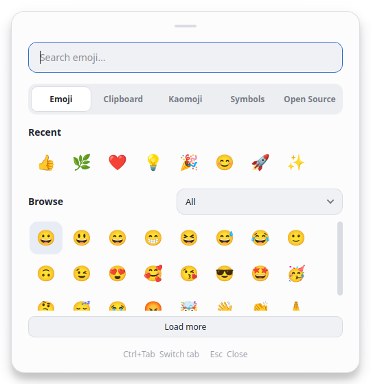
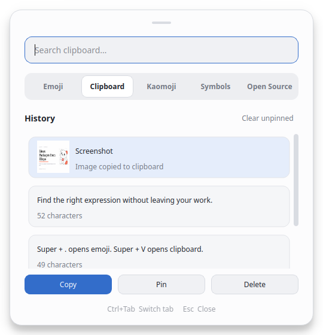

# Win Dot Panel

<p align="center"></p>

A quick emoji and clipboard panel for Linux. It has a clean, macOS-inspired look and the familiar Windows emoji picker behavior: choose an emoji, keep the panel open, and choose another.

Built for GNOME and KDE Plasma on Wayland or X11.

## Preview

<p align="center">
  <a href="docs/images/emoji-panel.png"></a>
  <a href="docs/images/clipboard-panel.png"></a>
</p>

The clipboard items shown here are examples.

## What you can do

- Find emoji, kaomoji, and symbols, even without an internet connection.
- Reuse copied text and screenshots from your clipboard history. Search, pin, or delete entries.
- Insert a character into the field you were using when the app can access it. Otherwise, the app copies it and shows you how to paste it.
- Switch between light and dark appearances with your desktop.

Your clipboard history stays on your computer.

## Install

The Debian package is available for Debian 13 and Ubuntu 26.04. Add the signed APT repository once, then install with your normal package manager:

```bash
sudo apt update
sudo apt install curl gnupg
sudo install -d -m 755 /etc/apt/keyrings
curl -fsSL -o /var/tmp/win-dot-panel-apt.asc \
  https://packages.elixpo.com/apt/keyring.asc
sudo gpg --dearmor --yes -o /etc/apt/keyrings/win-dot-panel.gpg \
  /var/tmp/win-dot-panel-apt.asc
echo 'deb [signed-by=/etc/apt/keyrings/win-dot-panel.gpg] https://packages.elixpo.com/apt/ ./' | \
  sudo tee /etc/apt/sources.list.d/win-dot-panel.list
sudo apt update
sudo apt install win-dot-panel
apt-cache policy win-dot-panel
```

The same steps are on [packages.elixpo.com](https://packages.elixpo.com/). If you prefer a standalone package, get the latest stable `.deb` from [GitHub Releases](https://github.com/Circuit-Overtime/linux-clipboard/releases/latest). For other Linux distributions, see the [developer guide](docs/development.md).

Starting with version `0.1.0-5`, the installer prints the shortcut commands and adds an app-menu launcher. On any installed version, `/usr/bin/win-dot-panel toggle` opens the panel.

## Open the panel

Run `/usr/bin/win-dot-panel toggle` to show or hide it. To start the app automatically when you sign in and keep clipboard history available, run `/usr/bin/win-dot-panel install` once.

To open it with **Super + .**, add `/usr/bin/win-dot-panel toggle` as a custom keyboard shortcut in your desktop settings. Assign **Super + V** to `/usr/bin/win-dot-panel toggle-clipboard` to open the Clipboard tab directly. Follow the [GNOME or KDE shortcut guide](docs/shortcuts.md) if you need help. The shortcut also starts the app if it is not already running.

If you previously ran the app from a local `.venv`, change your desktop shortcuts to these `/usr/bin` commands and run `/usr/bin/win-dot-panel install` again to refresh its login startup entry.

The panel opens near your pointer. Drag the small handle at the top to move it. Use the tabs to browse or search. Click an emoji or symbol to insert it. On the Clipboard tab, select an entry and choose **Copy** to use it again. Press **Esc** to close the panel.

The **Open Source** tab links to the repository, issues, and documentation.

## Update

With the APT repository configured, run:

```bash
sudo apt update
sudo apt install --only-upgrade win-dot-panel
/usr/bin/win-dot-panel quit
```

The last command closes any older background process; the next shortcut press starts the updated app. A message saying the daemon is not running is harmless. Normal system upgrades also include new stable versions.

If you previously installed a `.deb` manually, adding this APT source lets future stable versions arrive through APT. `apt-cache policy win-dot-panel` shows the installed version and the available candidate.

## Remove

To stop starting at login, run `/usr/bin/win-dot-panel uninstall`. To remove the app, run `sudo apt remove win-dot-panel`. Removing it does not erase your saved clipboard history.

Developing or packaging the app? See the [developer guide](docs/development.md) and [implementation plan](docs/implementation-plan.md).

## License

The app's code is available under the [MIT License](LICENSE). The bundled emoji data retains the [Unicode License v3](src/win_dot_panel/resources/UNICODE-LICENSE.txt).
