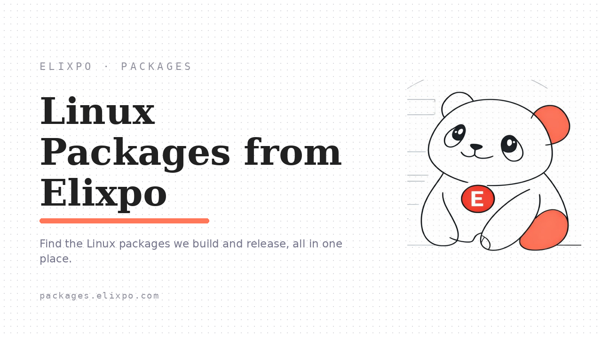
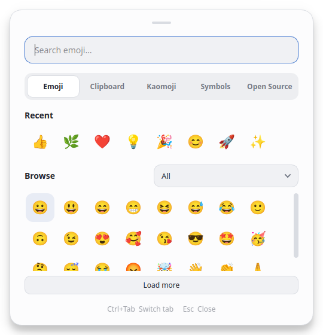
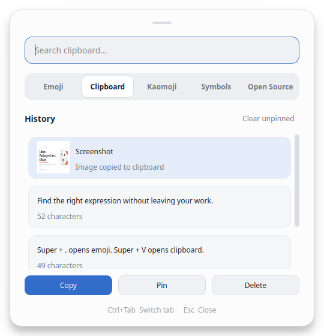

<p align="center">
  <a href="https://packages.elixpo.com/">
    
  </a>
</p>

<h1 align="center">Elixpo apps for Linux</h1>

<p align="center">
  Small, focused desktop tools that make Linux feel more complete.
</p>

<p align="center">
  <a href="https://packages.elixpo.com/"><strong>Browse all apps</strong></a>
  ·
  <a href="#install"><strong>Install</strong></a>
  ·
  <a href="https://github.com/elixpo/packages.elixpo/issues"><strong>Get help</strong></a>
</p>

---

## Choose an app

<table>
  <tr>
    <td align="center" width="50%">
      <a href="https://packages.elixpo.com/win-dot-panel/">
        
      </a>
      <h3>Win Dot Panel</h3>
      <p>A quick emoji picker and private clipboard history for Linux.</p>
      <p>Open it with familiar keyboard shortcuts, find what you need, and continue typing.</p>
      <p><a href="https://packages.elixpo.com/win-dot-panel/"><strong>See Win Dot Panel →</strong></a></p>
    </td>
    <td align="center" width="50%">
      <a href="https://packages.elixpo.com/screenbridge/">
        
      </a>
      <h3>ScreenBridge</h3>
      <p>Share sound from your computer during calls, recordings, and streams.</p>
      <p>Your microphone stays separate, with an optional combined input for apps that need one.</p>
      <p><a href="https://packages.elixpo.com/screenbridge/"><strong>See ScreenBridge →</strong></a></p>
    </td>
  </tr>
</table>

## Why these apps?

- **Simple:** each app solves one everyday Linux problem.
- **Private:** clipboard history stays on your computer, and no account is required.
- **Native:** designed for modern Ubuntu, Debian, GNOME, KDE Plasma, Wayland, and X11 desktops.
- **Easy to update:** normal system updates deliver new stable versions after installation.
- **Open source:** inspect the code, report a problem, or help improve it.

## Install

Choose the app you want and paste its command into Terminal.

<details>
<summary><strong>Install Win Dot Panel</strong></summary>

```bash
curl -fsSL -o /var/tmp/win-dot-panel-install.sh https://packages.elixpo.com/win-dot-panel/install.sh && bash /var/tmp/win-dot-panel-install.sh
```

After installation, set <kbd>Super</kbd> + <kbd>.</kbd> to open the picker and <kbd>Super</kbd> + <kbd>V</kbd> to open clipboard history. The installer prints the exact shortcut commands.

</details>

<details>
<summary><strong>Install ScreenBridge</strong></summary>

```bash
curl -fsSL -o /var/tmp/screenbridge-install.sh https://packages.elixpo.com/screenbridge/install.sh && bash /var/tmp/screenbridge-install.sh
```

Open **ScreenBridge** from your applications menu, choose where you listen and which microphone you use, then press **Start sharing audio**.

</details>

Both installers verify the official Elixpo signing key before adding the shared package source.

## Preview

<p align="center">
  <a href="apps/win-dot-panel/docs/images/emoji-panel.png">
    
  </a>
  &nbsp;
  <a href="apps/win-dot-panel/docs/images/clipboard-panel.png">
    
  </a>
</p>

## Help and updates

Visit [packages.elixpo.com](https://packages.elixpo.com/) for current installation information. If something does not work, [open an issue](https://github.com/elixpo/packages.elixpo/issues) and include your Linux distribution and desktop environment.

Developers and maintainers can find the repository layout, test commands, release process, and signing documentation in the [technical guide](docs/maintainers.md).

## License

ScreenBridge and the repository tools use the MIT License. Win Dot Panel uses MIT-licensed application code and includes emoji data under the Unicode License v3.
